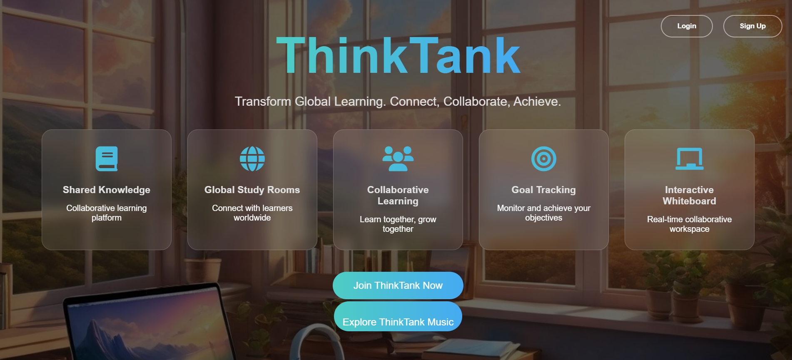
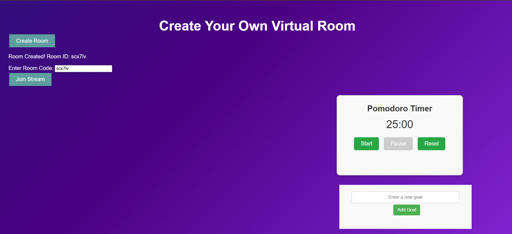
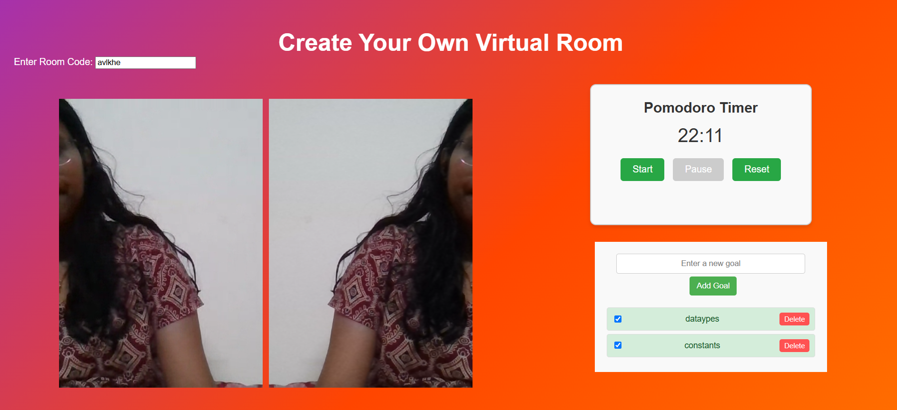
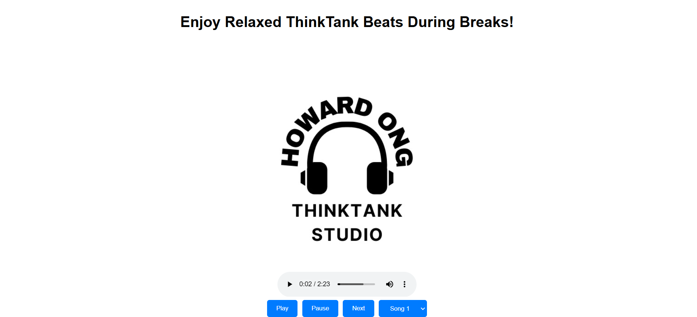

# ThinkTank 🎯

## Basic Details
### Team Name: CodeCrew

### Team Members
- Member 1: Krupa Anna Kuruvilla - MITS
- Member 2: Mariat Ignatiouis - MITS
- Member 3: Archana Jayakumar - MITS

### Hosted Project Link
[Hosted link:](https://thinktank-i6qn.onrender.com/)

### Project Description
ThinkTank is a video chat based virtual study room designed to revolutionize the way students and professionals collaborate and focus. With synchronized Pomodoro timers, calming break music, goal tracking, and video chat capabilities, it creates an environment that boosts productivity and concentration.

### The Problem statement
Studying alone or staying focused during group study sessions can often be challenging due to distractions, lack of motivation, and no proper tools to track progress.

### The Solution
ThinkTank offers a seamless platform for synchronized study sessions where group members can track goals, enjoy shared timers, and connect through video. Integrated break-time activities and music ensure a perfect balance of focus and relaxation.

## Technical Details
### Technologies/Components Used
For Software:
- **Languages Used**: JavaScript, HTML, CSS
- **Libraries Used**: AgoraRTC, Firebase
- **Tools Used**: Firebase Firestore, GitHub, Figma

### Implementation
For Software:
# Installation
[git clone [repository-link]
cd ThinkTank
npm install]

### Project Documentation

*Home Page -ThinkTank -Virtual study room

* A sleek and user-friendly interface for joining or creating study rooms.

* Collaborative study sessions with video streaming with Synchronized Pomorado Timer and Goal setting.

*Enjoy relaxed music with ThinkTank studio during breaks

### Project Demo
# Video
[Demo video link:](https://www.loom.com/share/50b9bb373a844bee9fabc81e5670ebdc?sid=a18adfdd-5de2-425d-a0f2-f7de1de6f6a5)

## 🎯 How It Works

1. **Create or Join a Virtual Room**  
   - Click "Create Room" to generate a unique Room ID.  
   - Share the Room ID with your friends to join the study session.

2. **Start the Pomodoro Timer**  
   - Begin focused study sessions with built-in timers.  
   - Take breaks as prompted to refresh your mind.

3. **ThinkTank Studio**  
   - Enable the music feature for a calming study experience.  

4. **Collaborate & Focus**  
   - Use video and audio features to interact and motivate each other.  

## Team Contributions
- Krupa Anna Kuruvilla: video chat integration, and timer synchronization,Firebase integration.
- Mariat Ignatious: Goal page,front-end design,home page,music integration
- Archana Jayakumar:Pomorado Timer,front-end design 

